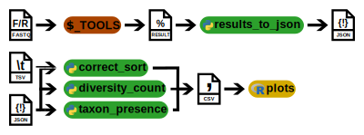

# Metagenomic taxonomic profilling tools analysis

This is the collection of codes developed for my Undergraduate Thesis. Its purpose is to benchmark different Metagenomics Tools for Taxonomic Classification.

## Dependencies

* Biopython, Pandas, NumPy
* Modules - csv, os, json, argparse
* python 3.6+

## Scripts



### results_to_json.py

This script takes result files from Metagenomics Tools for Taxonomic Classification and gets the correctly classified reads.

### correct_sort.py

This is a module for "results_to_json.py" that analyses the JSON output files and classifies the reads in correct, incorrect and unclassified.

### diversity_count.py

This script counts how many taxons there are per rank in the gold standard CAMI files.

### taxon_presence.py

This script gets the presence of all classified taxa between the tools and outputs a binary matrix

### plots.R

This R script is only used to plot the figures for sensitivity (correctly classified reads over all reads) and precision (correctly classified reads over all classified reads).

### Other scripts

#### cami_taxid_fix.py

This script gets the species Taxid from accessions of the CAMI mock files.

#### genome_downloader.sh

This script downloads the genomes and proteins from the NCBI "assembly_summary.txt" file.

## Usage

### results_to_json.py

This can currently handle the output from Kaiju, Kraken 2, Centrifuge and Metacache. It also needs a gold standard with the correct mapping of the reads to their correct TaxID ideally on species level.

```$ results_to_json.py -in INFILE1 INFILE2 ... -out OUTDIR```

* -in / --infiles -> All the input files to be analysed
* -out / --outdir -> Directory where the output files will be saved to. (Default is the one where this script is located on)

#### Output

This program currently outputs a JSON file for each file with a dictionary with the taxonomy path for each read for downstream analysis.

### correct_sort.py

It takes the JSON files from results_to_json.py and classifies it.

```$ correct_sort.py -in INFILES -gs GOLD_STANDARD_FILE -t TAXONOMY -out OUTDIR```

* -in / --infiles -> Input files with reads and taxonomy IDs in JSON format from results_to_json.py. It can be called multiple times. Supported: CAMI, Kaiju, Kraken 2, Centrifuge, Metacache
* -gs / --gold_standard -> Input reads mapping file
* -t / --taxonomy -> Taxonomy level. Currently accepts superkingdom, phylum, class, order, species. (Default is species)
* -out / --outdir -> Directory where the output files will be saved to. (Default is the one where this script is located on)

#### Output

It outputs only one CSV file "statistics_result.csv" which has the counts for each program's correctly, incorrectly and unclassified reads at one taxonomic level at a time.


### diversity_count.py

It takes the CAMI reads mapping file and counts how many taxons there are per taxonomic level.

```$ diversity_count.py -gs READS_MAPPING -out OUTDIR```

* -gs / --gold_standard -> Input reads mapping file.
* -out / --outdir -> Directory where the output files will be saved to. (Default is the one where this script is located on)

#### Output

It outputs the CSV file "count_diversity_cami.csv" with the counts for each taxonomic level and sample.

### taxon_presence.py

It takes the JSON files from results_to_json.py and gets the presence of all classified taxa between the tools.
```$ taxon_presence.py -in INFILES -out OUTDIR```

* -in / --infiles -> Input files with reads and taxonomy IDs. It can be called multiple times.\nCurrently supported: Standard, Kaiju, Kraken 2, Centrifuge, Metacache
* -out / --outdir -> Directory where the output files will be saved to. (Defult is the one where this script is located on)

#### Output

It outputs a binary matrix in CSV format "taxa_matrix_{tax_level}.csv" with the presence of all classified taxa between the tools.

### plots.R

It takes the CSV files from all outputs and makes makes the figures.

### Other scripts

#### cami_taxid_fixer.py

It takes the sample reads mapping files and gets the taxIDs from NCBI.

```$ cami_taxid_fixer.py FILES```

* FILES -> Sample reads mapping files.

##### Output

Outputs a file with the taxIDs at species or strain level.

#### genome_downloader.sh

```genome_downloader.sh -f ASSEMBLY_SUMMARY -d SAVE_DIR (-p)```

* -f -> Input the assembly_summary.txt file from NCBI genomes database.
* -d -> Directory where the output files will be saved to.
* -p -> If specified, it will download the protein colection not the genome.

